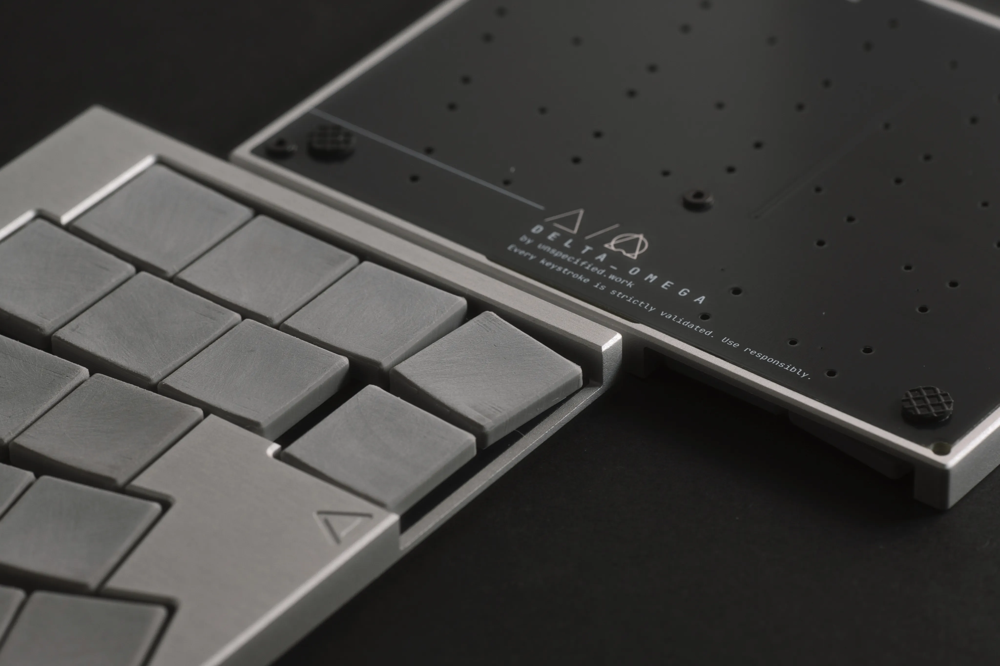
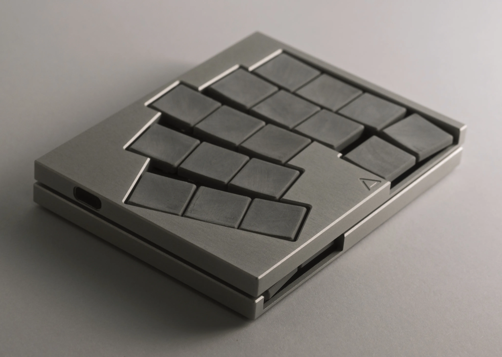
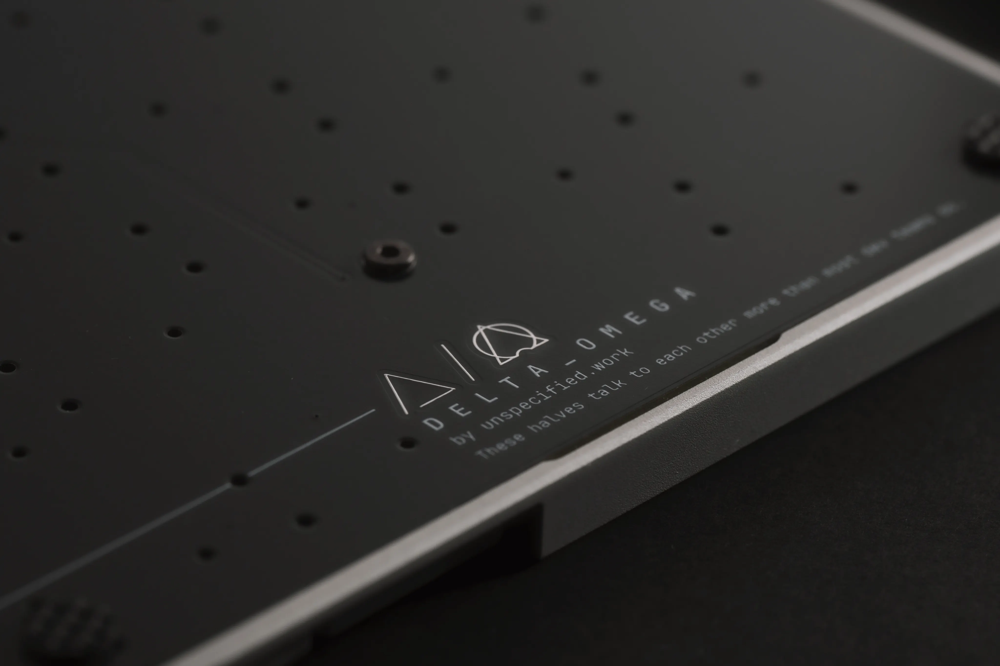

> [!WARNING]
> work in progress.

## Prototype v1

quite nice!

### Next (and Last) Prototype TODO List
- [x] Dropping support wired mode.
- [x] Thumbcluster adjustment.
- [x] Thumbcluster outer key angle adjustment.
- [ ] How to stuck them together? magnets? or not to be.
- [x] Just XIAO nRF52840, with Diodes. not Plus.
- [ ] Add some high-profile keycap models (like the KLP Lame) for people who want everything in one or using own carrying case. and wants to avoid touching the cases.
- [ ] Remove ble signal port's notch. for easy cover printing.
- [x] Support hand solder. (maybe need to adding bottom plate)
- [x] Support Kailh PG1316s for alternative switches. (merging two foot prints if possible)

#### Aug 19 Update

* **Reset Switch**
  
  Changed the upward-facing SMD reset switch to a side-facing SMD switch and moved it right next to the power switch.

* **PCB Options**
  
  Planning to upload multiple PCB choices. The default thickness will be 1.6 mm, but users can opt for a 0.8 mm PCB with an additional 0.8 mm cover layer (PCB or CFRP) to build in their preferred style.

* **Soldering Versions**
  
  Will upload both an all-SMD version and a hand-solder–friendly version of the PCB.

* **Wired Support**
  
  Completely removed wired support. However, TX and RX pins are left unused, and I left space for a USB-C receptacle footprint. Anyone who wants wired can add the footprint and modify the case accordingly.

* **BLE Reception**
  
  BLE reception is generally fine, but I’ve made some extra improvements just in case.

#### Aug 17 Update

* **Switch Footprint**
  
  Reworked the switch footprint for compatibility with diodes and PG1316s, and also to allow for hand soldering. Soldering might still be tricky, but I think it’s a solid approach.

* **Thumb Cluster**
  
  Adjusted the angle of the outer thumb keys from 7° to 2° and moved them slightly further outward.

* **MCU Controller**
  
  Changed to the XIAO nRF52840 (standard model). Also tweaked its placement and made it more hand-soldering friendly. This may make the keyboard’s underside look a bit ugly.

* **Case & Magnets**
  
  Added spots for three 8 mm diameter neodymium magnets (top-left, bottom-left, top-right) so the two halves can be attached face-to-face for carrying.

  * This overlaps with the space for the USB-C receptacle used for interconnection. So, wired mode will either no longer be supported, or you’ll have to skip the magnets.
  * Even if unused, the USB-C MP’s THT pins may still leave an empty port on the case, which could be a cosmetic issue.
  * Since the halves snap tightly together, some kind of surface protection may be needed.

* **MagSafe Consideration**
  
  Need to check if there’s enough bottom space for thin magnets or metal stickers to work with MagSafe. The central mounting screw might block an ideal position. otherwise, a separate MagSafe adapter design might be required.
 

---
 
 
 

# DELTA OMEGA

A wireless/wired 3x5+2 split keyboard using **Cherry MX ULP** switches.

## Overview

* Supports wireless and wired.
  - Hybrid: One firmware. BLE or Wired between halves. Runtime switching. BLE or USB via Host.
  - Single: BLE Firmware or Wired firmware. BLE or USB via Host or Dongle.
* Default aluminum case (other materials optional).
* ZMK firmware support.
* Choc spacing layout.
* 7mm low-profile case.

## Aluminum Case

The aluminum case has been modeled to be as cost-effective as possible, given my machining limitations.
It is designed under the assumption of **3-axis CNC machining** with minimal tool changes. ideally using a single endmill where possible.
I am not a machining expert, so if you have suggestions for improvement, please share them.

Case variants:
 - Hybrid
 - Wireless Only: without Interconnection USB-C port.

## PCB

The PCB design contains **both left and right halves** in a single file.
While it’s possible to panelize and order them as one PCB using mouse bites or v-cut, I recommend ordering them as **two separate boards** for cleaner edge finishing. The cost difference is negligible.

This design does **not** use a reversible PCB because it’s intended for a bottomless style case where the PCB is exposed.

## Why XIAO Plus?

The **Seeed XIAO nRF52840 Plus** is a recently released version with additional pins.
I chose it to enable **direct GPIO key scanning without diodes**.

While diodes could be installed inside the switch footprint, the assumption here is that if you’re using **Cherry MX ULP** switches, you’re already working with a hot plate or hot air station. so we will solder the XIAO as an SMD part directly.

## Bill of Materials 

| Item    | Quantity | Notes    |
| -------------------------------- | -------- | ------------------------------------------------------------------- |
| Seeed XIAO nRF52840 Plus     | 2        | Controller                                                          |
| PCB (Left + Right)   | 1 each   | Ordered separately for cleaner edges                                |
| Case (Left + Right)     | 1 each   | Aluminum by default                                                 |
| Cherry MX ULP switches   | 34       | -                                                                   |
| USB-C receptacle, 16-pin    | 2        | For wired version                                                   |
| Power switch MK-12C02   | 2        | For wireless version                                                |
| LiPo 3.7 V battery  | 2        | Max size: 25.2 × 17.7 × 4.2 mm (wireless)                           |
| M2 thin flat-head screws, 4 mm Length | 10       | -                                                                   |
| Reset switch (SMT, 4×4 mm)   | 2        | 0.8 mm height recommended; optional—can short with tweezers instead |
| Feet       | 8        | Any shape/size; should be taller than screw heads                   |
| BLE port cover    | 2        | Separate model available                                            |
| 4.7kΩ Resistor 0603 | 1 | For the hybrid connection between Wireless and Wired |
