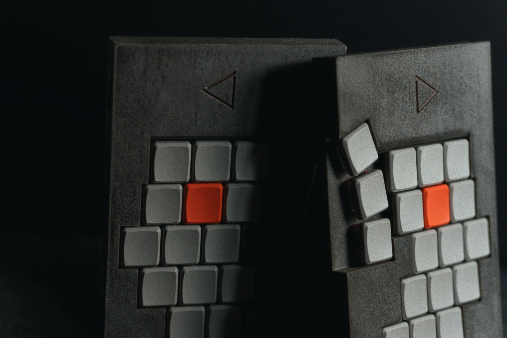
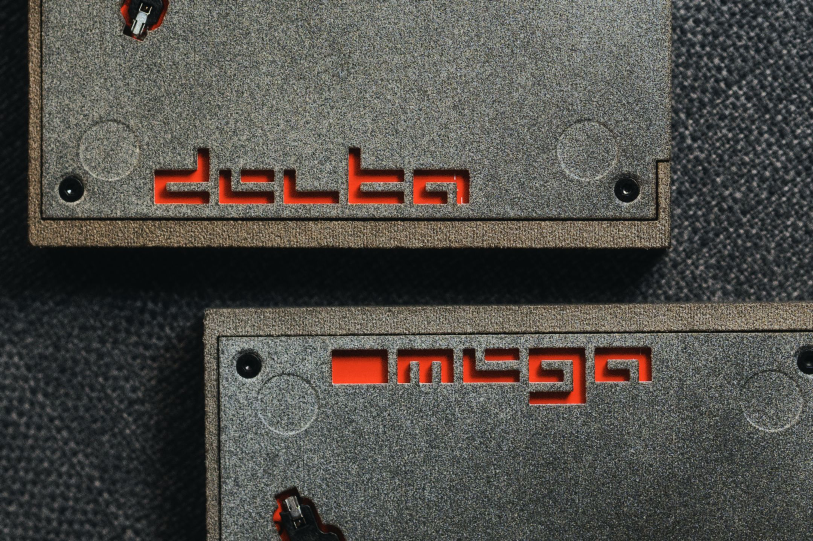
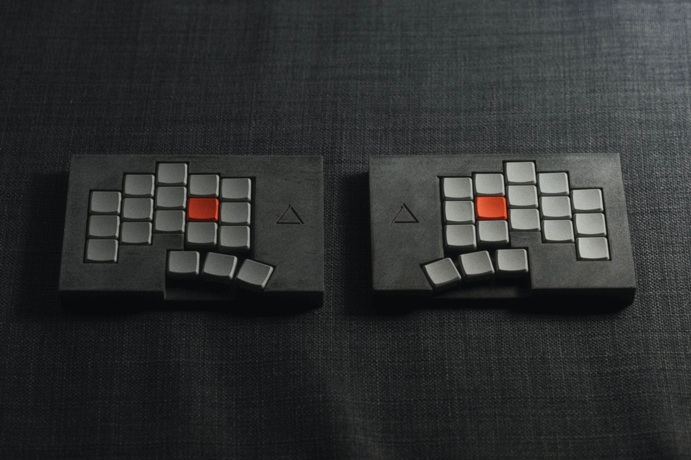

> [!WARNING]
> work in progress.

# BETA OMEGA

A 'brutalist' concepted ergonomic split keyboard.

## Features

- optional case 
- wireless / wired
- choc v1
- choc spacing
- two layout supports
    - 3x5+3 
    - 3x6+3 

## TODO

 - [ ] CASE.
    - [x] `choc_v1_wireless_3x5_3`
    - [ ] `choc_v1_wireless_3x6_3`
    - [x] `choc_v1_wired_3x5_3`
    - [ ] `choc_v1_wired_3x6_3`
  

 - [ ] PCB.
    - [x] `choc_v1_wireless_3x5_3`
    - [ ] `choc_v1_wireless_3x6_3`
    - [x] `choc_v1_wired_3x5_3`
    - [ ] `choc_v1_wired_3x6_3`

 - [ ] Firmware

 ## Log
 
### Prototype 1
#### Overview
The first prototype has arrived, produced using JLCPCB's MJF Nylon(Natural Gray). Overall, the results are promising and align well with the design concept.

#### Case Surface
The finish of the MJF Natural Gray material is satisfactory. 

One noticeable characteristic is the variation in tone between different surfaces. While this could be considered a flaw in uniformity, it actually contributes to the raw and unfiltered aesthetic that fits the intended concept.

The top surface appeared significantly darker than the sides, so a light sanding was performed using sandpaper. This resulted in a more natural, concrete-like appearance, which is both visually appealing and conceptually fitting.

#### Case Design Issues
A major issue was encountered with the wall thickness of the case. Due to increased wall thickness, access to the power and reset buttons became impossible.

By reducing the wall thickness or by redesigning the button interfaces. While the current wall thickness does not appear excessive, the problem may also be addressed by switching to alternative button types.  

However, since accessibility and the use of standard components are critical, this option will be considered only as a last resort.

#### Deformation 
As expected with MJF, the 2mm thick bottom case exhibited noticeable warping under varying humidity conditions. While this is a known limitation of the material, it may be mitigated by introducing an additional screw point in the middle of the case. That said, the warping is not severe enough to warrant urgent action, so this may be left as-is for now.

#### Electronics
The PCB works well, with no major issues observed during initial testing. However, battery mounting remains problematic. Since the goal is to support a range of battery sizes—such as the commonly used “N!N” formats—it will be important to examine how other products handle battery fixation and derive an effective, adaptable solution from that research.

#### LED 
LEDs were included for layout indication and battery level display. However, their visibility is quite limited, and adding a diffuser feels undesirable at this stage. This part of the design will need to be revisited, possibly removing or redesigning the lighting strategy for better effectiveness.

#### So...

Not yet. 

Let's try Prototype 2.