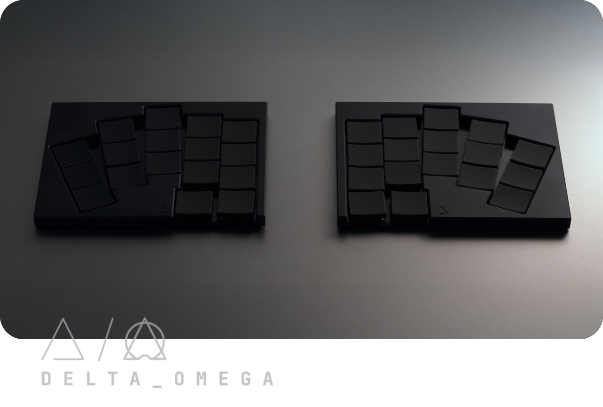
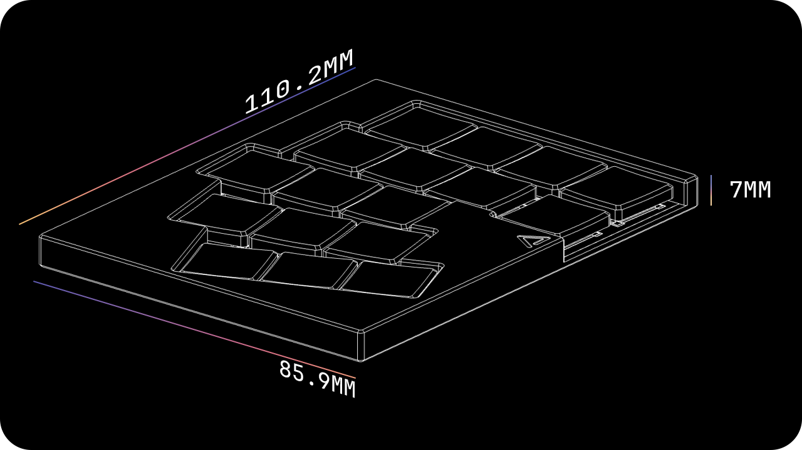
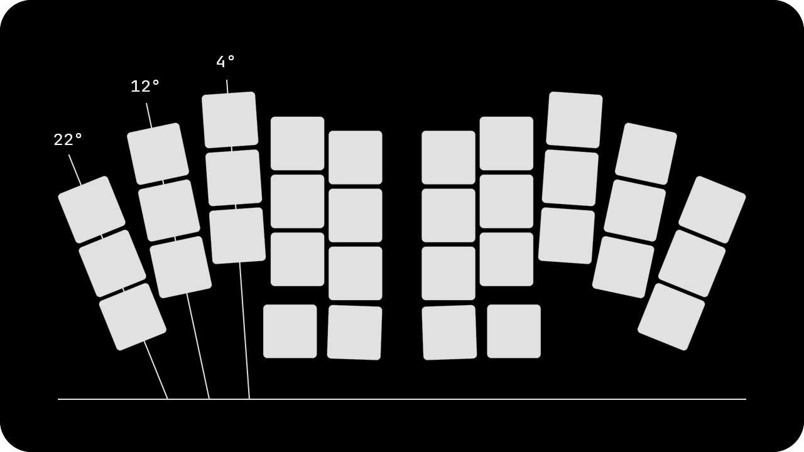
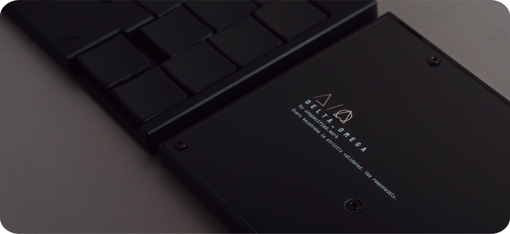

# DELTA OMEGA

A portable ultra-low-profile (ULP) wireless 3×5+2 split keyboard.

## Overview

- Switch support: Cherry MX ULP or Kailh PG1316s
- 34 keys, splayed and staggered with choc spacing
- Wireless
- CNC aluminum case

## Parameters

## Documentation

> [!NOTE]
> This is **not** a typical low-profile (LP) or MX build. While it may look familiar, there are enough differences here that skipping the documentation could cause issues. Please take the time to read all notes and guides before starting.

- [Getting Started](./docs/GETTING_STARTED.md)
- [Bill of Materials](./docs/BOM.md)
- [Build Guides](./docs/BUILD_GUIDES.md)
- [PCB](./pcb/README.md)
- [Case](./case/README.md)
- [ZMK Keyboard Module](https://github.com/unspecworks/zmk-keyboard-delta-omega)
- [Pre-conf ZMK Config](https://github.com/unspecworks/zmk-delta-omega)
- Keycaps
  - [Delta ULP Keycap](https://github.com/unspecworks/delta-ulp-keycap)

## Photos

- [Gallery](./gallery/README.md)
- [Prototype Gallery](./images/README.md)
  - Diff: Port position, Thumb-cluster layout and only hot-plate way.

## Acknowledgments and Inspirations

- [GEIGEIGEIST/TOTEM](https://github.com/GEIGEIGEIST/TOTEM)
- [mikeholscher/zmk-config-mikecinq](https://github.com/mikeholscher/zmk-config-mikecinq)
- [pashutk/Cherry_MX_ULP](https://github.com/pashutk/Cherry_MX_ULP)
- [zmk-rgbled-widget](https://github.com/caksoylar/zmk-rgbled-widget)
- [infused-kim/kb_ergogen_fp](https://github.com/infused-kim/kb_ergogen_fp)
- [ceoloide/ergogen-footprints](https://github.com/ceoloide/ergogen-footprints)
- [kiswitch/kiswitch](https://github.com/kiswitch/kiswitch)

## Limitations and Disclaimer

This is a hobby-driven project. Some aspects may be incomplete, imperfect, or problematic. Use this project **at your own risk**, and note that no warranties or guarantees are provided.

## License

DELTA OMEGA is licensed under [CERN-OHL-W-2.0](./LICENSE.md).

