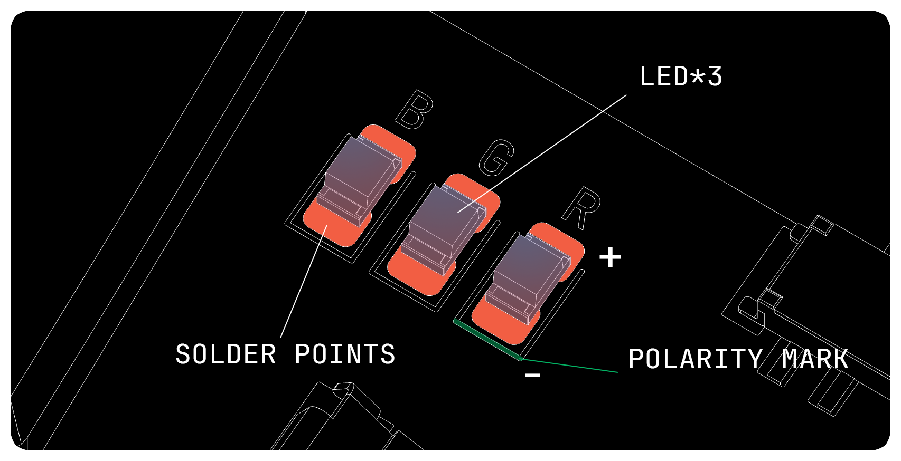
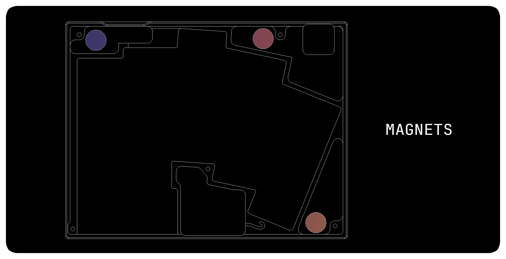
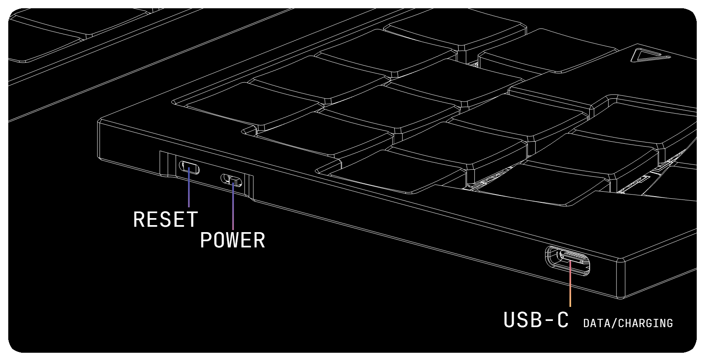

# Build Guides

This document covers the **hand-solder version** of the build process.

---

## Required Tools and Materials
- Soldering iron
- Solder wire
- Flux
- Ventilation system
- Knife or precision cutter
- silicone adhesive or cyanoacrylate 

If working with a mouse-bited PCB, you will also need:
- Mask
- Sandpaper

⚠️ **Note**: Be cautious when sanding PCBs. Fine dust can be hazardous.

> [!CAUTION]
> Always prioritize safety. Proper ventilation, a clean workspace, and appropriate protective equipment are **mandatory**, not optional.

---

## Power Switch

1. Apply solder to one of the wide pads.
2. Place the switch in position and hold it while reflowing the solder to tack it in place.
3. Solder the opposite wide pad.
4. Finally, solder the three smaller legs.

Correct alignment is essential (the boss features will help position the part).

> [!CAUTION]
> Keep the switch in the **OFF position (all the way to the right)** during the entire build. This is critical.

---

## Reset Switch

The process is nearly identical to the power switch:

1. Pre-solder one pad.
2. Position the switch and reflow to hold it in place.
3. Solder the remaining three pads.

As with the power switch, correct alignment is important (boss features assist here).

---

## LED (Optional)

1. Identify orientation: look for the **triangular corner marking** on the LED package. Match it with the silkscreen on the PCB.
2. Pre-solder one pad.
3. Place the LED in the correct orientation and reflow.
4. Complete soldering of the remaining pads.

> [!CAUTION]
> LEDs are sensitive to heat. Use the proper temperature (generally below 350 °C) and limit contact time to **under 5 seconds**. Allow sufficient cooling between solder joints.

---

## Diodes

1. Orientation is critical: align the diode’s polarity marking with the silkscreen.
2. Due to limited space (ULP switches share space originally intended for LEDs), apply a **minimal solder amount**, centered between pads.

> [!TIP]
> After soldering, temporarily place the switch above the diode to confirm there is no interference.

---

## Switches

This is often the most time-consuming step.

1. If castellated holes were not ordered, the through-holes may be damaged or deformed. Carefully trim protruding copper with a knife or nippers. Take care not to peel off the copper entirely.
2. Apply a small amount of solder to one pad.
3. Position the switch and reflow to tack it in place.
4. Solder the opposite pad, then the remaining corners (usually four points are sufficient).

Flip the board to solder the switch contact points:

- Ensure good contact between the switch terminals and the through-hole walls.
- Use flux and controlled heat so solder bonds properly to both.

> [!WARNING]
> For **Cherry MX ULP**, the right-side through-hole is positioned slightly outward to maintain compatibility with Kailh PG1316s. Excess solder flowing outward may block switch operation. Aim the solder inward, merging both contacts toward the center.

> [!TIP]
> Above each switch are two small test pads. Use a multimeter in diode mode to confirm continuity (flow direction: right → left).

---

## MCU Controller

1. **Flash firmware first** to verify the MCU is functional.
   - As a quick test, short GPIO pins 4 and 5 with tweezers or wire.
   - The keyboard should register a key press (left side: **T**, right side: **Y**).

2. Position the MCU. If needed, insert header pins in the top-right and bottom-left corners for stability. (Remove after soldering)

3. Solder the castellated edges of the XIAO to the PCB pads.

⚠️ When soldering along the **outer edge (left side of the left PCB)**:
- Apply only minimal solder.
- Avoid bridges that may contact the aluminum case.

4. On the PCB backside, solder the 4 additional connection points.
5. As with the switches, ensure solder bonds to both the XIAO and PCB.

---

## Battery

> [!CAUTION]
> Confirm the power switch is **OFF** before beginning.

> [!WARNING]
> Lithium-polymer (LiPo) batteries are hazardous. Even minor damage can lead to thermal runaway. Prevent shorts, punctures, or impacts. Mishandling can cause severe injury or damage to components.

1. This design does not use JST or Molex connectors. Wires are soldered directly.
2. Trim wires to length. Strip 1–2 mm of insulation and tin the exposed ends.
3. Double-check polarity (red = positive, black = negative).
4. Insulate the positive terminal with RTV silicone, Kapton tape, or another reliable method.

---

## Magnet (Optional)

Install magnets so that the polarity between the left and right cases is **aligned correctly**. ensuring they attract each other when closed.  

Secure the magnets in place using **silicone adhesive** or **cyanoacrylate (instant glue)**.  

If preferred, you can also print additional mounting parts to hold the magnets instead of adhesive.

---

## Case Assembly

1. Tilt the case slightly backward.
2. Align the rear ports first, then lower the front into place.

3. Fasten the PCB to the case using screws. Tightening should be firm but not excessive.
4. If using a cover plate, place it before fastening screws.

---

## Finish!

Your build is now complete!
