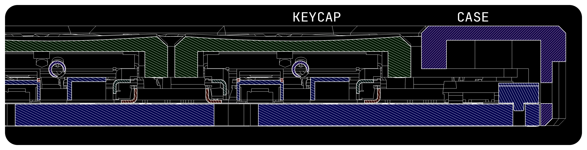
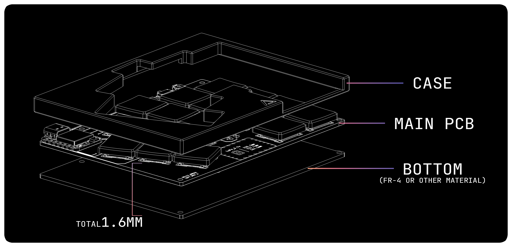
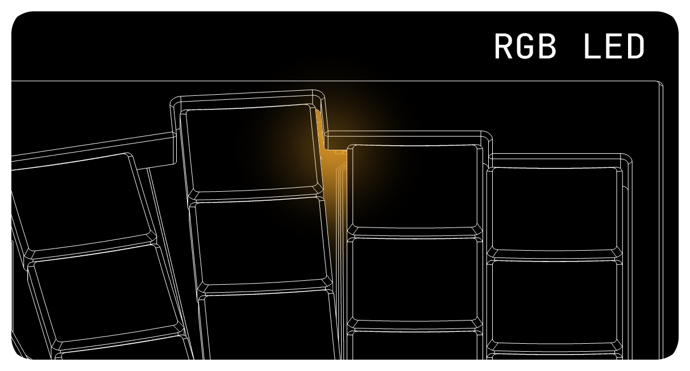

# Getting Started

Please read this document carefully before beginning your build.
It may be long and tedious, but every section is written with only the most essential information in mind.

---

## Step 1: Choosing Your Switches

This keyboard supports **Cherry MX ULP** or **Kailh PG1316S** switches.

### Cherry MX ULP
Developed by Cherry, available in both clicky and tactile versions.
- Actuation force: 65 gf (relatively heavy)
- Availability: very limited. both switches and compatible keycaps are difficult to source

#### Where to Buy
- Large distributors such as Mouser (very expensive)
- Geonworks (appears to be restricted to the Korean domestic market)

### Kailh PG1316s
Developed by Kailh, with specifications and mechanism very similar to Cherry MX ULP.
- Actuation force: 35 gf, 65 gf
- Easier to source than Cherry MX ULP
- Often sold together with compatible keycaps

#### Where to Buy *(unverified sources. use caution)*
- Modulo Industries
- Holykeebs

### Which Should You Choose?
It largely depends on availability. Due to market scarcity, the **best switch is usually the one you can actually get** at the time of building.

---

## Keycaps

The DELTA OMEGA uses **Choc spacing (18 × 17 mm)**.
- Standard ULP keycaps are **16 × 16 mm**. Using them will leave visible gaps between keys. Functionally this is fine, but the look may not be satisfying.

#### Suggested Approach
- Consider custom-printed ULP keycaps.
- Be aware: due to thin walls, 3D printed ULP keycaps can be fragile and prone to printing issues.
- Removing ULP keycaps is difficult; my chosen method is to use FDM-printed keycaps and destroy them (cut with a soldering iron or nippers) when replacements are needed.

> [!TIP]
> [@mikeholscher’s notes on removing keycaps](https://github.com/mikeholscher/zmk-config-mikecinq?tab=readme-ov-file#about-removing-keycaps) may be helpful.

#### Height Considerations
The DELTA OMEGA prioritizes portability, so the case is slightly taller than the switches.
- Ideally, the keycap should sit just below the case edge (≈0.3 mm).
- Some users may find this uncomfortable. consider high-profile keycaps as an alternative.

---

## Soldering

Both switch types are SMT by default, designed for hot plate or reflow soldering.
To make the board more approachable, footprints were modified for **hand soldering**. This still requires moderate skills.

---

## PCB

### Main PCB
The PCB is **non-reversible** — you will need a left and right pair.

Two ordering options:
1. A single Gerber including both left and right PCBs
2. Separate left and right PCB files

**Why?**
Ordering both together requires mouse-bites or V-cuts to split, leaving rough edges. Since DELTA OMEGA leaves the bottom PCB exposed, rough edges and tight tolerances can cause issues.

Cost difference is negligible (1~2 USD), so choose based on preference.

### PCB Thickness

Options:
- Single 1.6mm PCB
- Combination of 0.8mm main PCB + 0.8mm bottom cover

If not an issue, you can freely choose thickness.

> [!TIP]
> The cover can be countersunk for a flat bottom. Note that 0.8mm is too thin for a perfect countersink, and the lower right corner (on the left half) is especially challenging.

> [!TIP]
> Customize your cover with some designs.

---

## Case

The case is recommended to be **CNC aluminum**.
Due to the thin and portability focus, a rigid case material ensures durability.

### Cost
CNC machining is often the largest concern.

- With JLC CNC (Aluminum A6061, bead blasting + anodizing):
  Approx. **32 USD per side**
- Prices may vary, and should only be considered a rough reference

> [!TIP]
> Ordering multiple units (e.g., with friends) significantly reduces cost — as low as 30 USD per side. Coupons and alternative CNC shops can further reduce expenses.

Combined PCB + CNC costs are generally around **80–100 USD (excluding shipping/tax)**.

### Magnets
Three magnets can be installed inside the case to allow the halves to snap together for portability.

- This is optional; if you’re concerned about scratches, consider alternative storage solutions.
- Refer to the BOM for recommended magnet specifications (tested values).

---

## Indicator LED

> [!WARNING]
> This feature still needs some work. planning to customize [caksoylar/zmk-rgbled-widget](https://github.com/caksoylar/zmk-rgbled-widget) for it, but it could end up failing.

DELTA OMEGA supports an optional **indicator LED**, which can be used for battery level or Bluetooth profile status.

- To maintain a clean exterior, no holes or slots are cut for the LED.
- Instead, the LED shines through indirectly, creating an **ambient glow**.

> [!TIP]
> On black anodized cases, light reflection may be limited. If brightness is insufficient, consider adding reflective tape inside the case.

---

## Next Steps

- [Bill of Materials](./BOM.md)
- [Build Guides](./BUILD_GUIDES.md)
