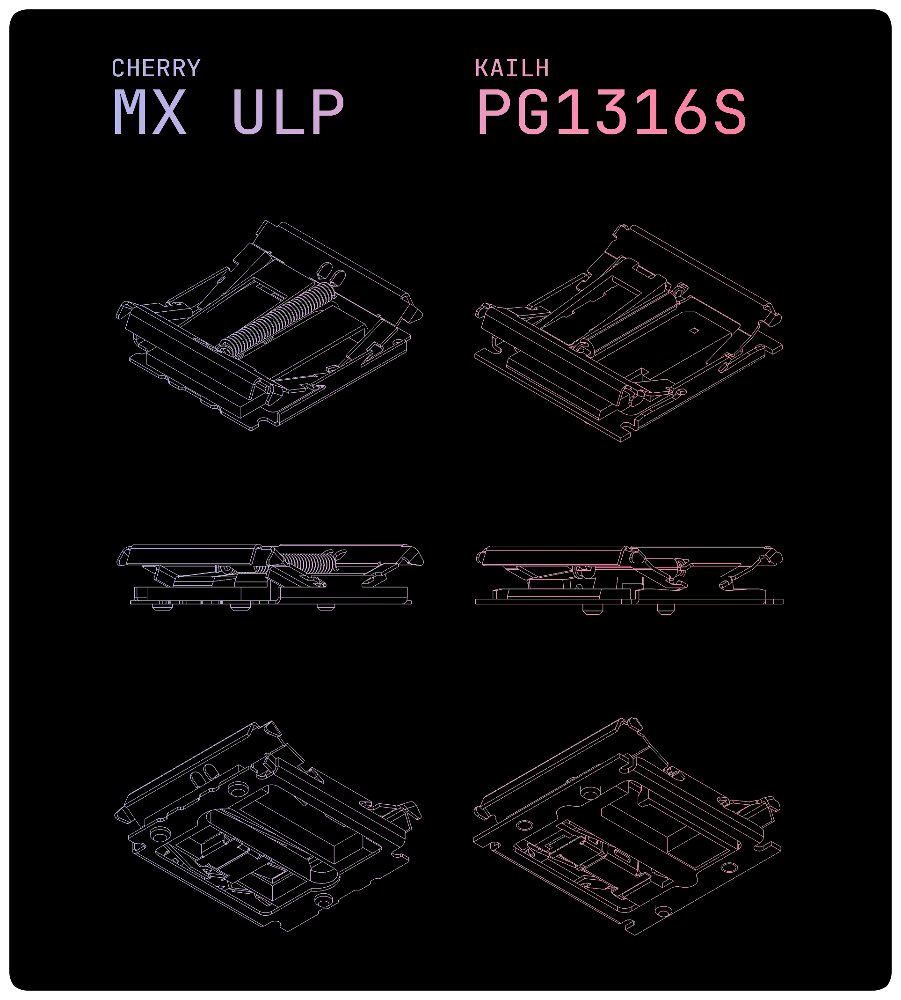

# Getting Started

Please read this document carefully before beginning your build.
It may be long and tedious, but every section is written with only the most essential information in mind.

## Step 1: Choosing Your Switches

This keyboard supports **Cherry MX ULP** or **Kailh PG1316S** switches.

### Cherry MX ULP
Developed by Cherry, available in both clicky and tactile versions.
- Actuation force: 65 gf (relatively heavy)
- Availability: very limited. both switches and compatible keycaps are difficult to source

#### Where to Buy
- Large distributors such as Mouser (very expensive)
- Geonworks (appears to be restricted to the Korean domestic market)

- Or, harvesting parts by desoldering from some commercial products. More details [here](https://github.com/pashutk/Cherry_MX_ULP).

### Kailh PG1316s
Developed by Kailh, with specifications and mechanism very similar to Cherry MX ULP.
- Actuation force: 35 gf, 65 gf
- Easier to source than Cherry MX ULP
- Often sold together with compatible keycaps

#### Where to Buy *(unverified)*
- Modulo Industries (US)
- Holykeebs (US)
- Keycapsss (EU)

### Which Should You Choose?
It largely depends on availability. Due to market scarcity, the **best switch is usually the one you can actually get** at the time of building. and don't forget the acuation force.

## Keycaps

The DELTA OMEGA uses **Choc spacing (18 × 17 mm)**.
- Standard ULP keycaps are **16 × 16 mm**. Using them will leave visible gaps between keys. Functionally this is fine, but low height and little wider gaps with higher quality. Refer to [Dell's Stock Cherry ULP Keycap Image](./../gallery/doo4.webp) and [Custom printed Keycap Image](./../gallery/d2.webp).

#### Suggested Approach
- Consider custom-printed ULP keycaps. Be aware: due to thin walls, 3D printed ULP keycaps can be fragile and prone to printing issues.
- You can loot keycaps from repair modules or broken parts of Dell laptop keyboards that use some Cherry MX ULP switches. Check [here](https://github.com/pashutk/Cherry_MX_ULP?tab=readme-ov-file#where-to-source) for reference.

- Removing ULP keycaps is difficult; my chosen method is to use FDM-printed keycaps and destroy them (cut with a soldering iron or nippers) when replacements are needed.

> [!TIP]
> [@mikeholscher’s notes on removing keycaps](https://github.com/mikeholscher/zmk-config-mikecinq?tab=readme-ov-file#about-removing-keycaps) may be helpful.

#### Height Considerations
The DELTA OMEGA prioritizes portability, so the case is slightly taller than the switches.
- Ideally, the keycap should sit just below the case edge (≈0.3 mm).
- Some users may find this uncomfortable. consider high-profile keycaps as an alternative.

## Soldering

Both switch types are SMT by default, designed for hot plate or reflow soldering.
To make the board more approachable, footprints were modified for **hand soldering**. This still requires moderate skills.

## PCB

### Main PCB
The PCB is **non-reversible** — you will need a left and right pair.

Two ordering options:
1. A single Gerber including both left and right PCBs
2. Separate left and right PCB files

**Why?**
Ordering both together requires mouse-bites or V-cuts to split, leaving rough edges. Since DELTA OMEGA leaves the bottom PCB exposed, rough edges and tight tolerances can cause issues.

Cost difference is negligible (1~2 USD), so choose based on preference.

### PCB Thickness

Options:
- Single 1.6mm PCB
- Combination of 0.8mm main PCB + 0.8mm bottom cover

If not an issue, you can freely choose thickness.

> [!TIP]
> The cover can be countersunk for a flat bottom. Note that 0.8mm is too thin for a perfect countersink, and the lower right corner (on the left half) is especially challenging.

> [!TIP]
> Customize your cover with some designs.

## Case

The case is recommended to be **CNC aluminum**.
Due to the thin and portability focus, a rigid case material ensures durability.

### Cost
CNC machining is often the largest concern.

- With JLC CNC (Aluminum A6061, bead blasting + anodizing):
  Approx. **32 USD per side**
- Prices may vary, and should only be considered a rough reference

> [!TIP]
> Ordering multiple units (e.g., with friends) significantly reduces cost — as low as 30 USD per side. Coupons and alternative CNC shops can further reduce expenses.

Combined PCB + CNC costs are generally around **80–100 USD (excluding shipping/tax)**.

### Magnets
Three magnets can be installed inside the case to allow the halves to snap together for portability.

- This is optional; if you’re concerned about scratches, consider alternative storage solutions.
- Refer to the BOM for recommended magnet specifications (tested values).

### CNC Experience with JLC

For prototyping, I placed around six CNC orders from JLCCNC. Overall, the quality was acceptable: some uneven chamfering and minor surface scratches (barely noticeable) were present. But one piece arrived slightly warped(deformation), which is understandable given the hollow structure and thin sidewalls. so it carries an inherent risk of deformation. In my case, about 0.3 mm of tolerance shift occurred, requiring some manual adjustment with hand tools.

If you encounter similar issues, it would be a good idea to discuss them directly with JLC and work out possible solutions.

## LED Indicator

The design utilizes three individual LEDs as an indirect glow indicator. The color may be chosen according to user preference; however, the default configuration is Red, Green, and Blue. Refer to the [zmk-rgbled-widget](https://github.com/caksoylar/zmk-rgbled-widget) documentation to adjust the settings according to your preference.

When operating LEDs at 3.3 V, it is recommended to install appropriate resistors. Using resistors with lower resistance values will increase brightness, but also result in higher battery consumption and, to a lesser extent, greater load on the MCU. Note that even when identical resistor values are used, brightness may vary by LED color. Consider these factors when selecting resistor values. If uncertain, a 220Ω resistor is generally a safe and effective choice.

## Battery

You can use a 3.7V Li-Po battery. The size must fit within **25.2 mm × 17.7 mm × 4.2 mm**.
However, the commonly available **401725** model may not fit properly. This is because typical specifications often exclude the size of the protection circuit, and lithium polymer batteries tend to have significant packaging tolerances.

Be sure to check the actual dimensions before purchasing. Do not force the battery into place.

---

## Next Steps

- [Bill of Materials](./BOM.md)
- [Build Guides](./BUILD_GUIDES.md)
